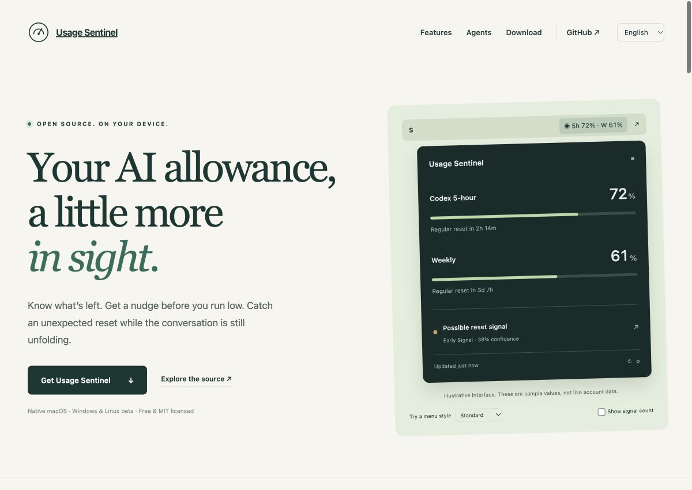

<div align="center">


# Usage Sentinel

**Your AI allowance, a little more in sight.**

Native menu bar / system tray companion for quota reminders and early reset signals.

[](https://github.com/Joe05520/usage-sentinel/actions/workflows/build.yml)
[](LICENSE)
[](https://github.com/Joe05520/usage-sentinel/releases)
[](Portable/README.md)

[**Website & interactive demo**](https://joe05520.github.io/usage-sentinel/) · [**Download**](https://github.com/Joe05520/usage-sentinel/releases/tag/v1.4.0) · [Agent setup](docs/AGENTS.md) · [繁體中文](docs/README.zh-Hant.md)

</div>



The website preview uses illustrative quota values. Actual account readings stay in the desktop app.

## Know what is left. Notice what changes.

Usage Sentinel combines an actual usage meter, a personal reset detector and a public reset-signal monitor. It lives in the macOS menu bar or Windows/Linux system tray and keeps account data on your device.

- **Actual quota windows:** Remaining percentage, next regular reset and last successful update. Missing limits are not invented. Failed reads show unknown/stale data explicitly.
- **Up to five staged reminders:** Choose distinct remaining-quota thresholds such as **50 → 30 → 20 → 10 → 5%**. Add, remove or adjust stages. Delivered stages persist across restart. Crossing several at once sends one alert. Pause reminders for one hour.
- **Unexpected personal increases:** If allowance jumps before its previous scheduled reset, get account evidence immediately after a successful poll. A personal reset does not prove a global reset.
- **Early public signals:** Official OpenAI updates, GitHub and Reddit are monitored independently. Default notification confidence is **25%**, with 15%, 60% and 90% options. Hacker News is optional; X needs an authorized feed and is not configured.
- **Evidence attached:** Events retain title, URL, platform, publication/fetch times, public author, snippet and confidence. Related reports merge; duplicate texts/authors do not inflate the score.
- **Quiet upgrades:** Re-notify on a confidence-level upgrade or your own account's correlated reset, not every small score change. Scheduled resets are quiet.
- **Flexible appearance:** macOS offers Standard, Compact, Percentages, Single quota and Icon only. Signal counts and banked-credit display are optional. Portable tray icons offer brand or percentage, with detailed quota in the menu/tooltip.
- **Five app languages:** English, 繁體中文, 简体中文, 日本語 and 한국어. Original source posts stay in their original language.
- **Local history and diagnostics:** SQLite snapshots retained for 35 days, event evidence up to a year, source health, refresh controls and copyable diagnostics. Native macOS includes history charts and confidence timelines.
- **Login launch:** Optional macOS Login Item, Windows user Run entry or Linux desktop autostart.

## Downloads

| Platform | Package | Status |
| --- | --- | --- |
| macOS 14+, Apple Silicon / Intel | [Universal ZIP](https://github.com/Joe05520/usage-sentinel/releases/download/v1.4.0/UsageSentinel-1.4.0-macOS-universal.zip) | Native SwiftUI/MenuBarExtra. Built and run on Apple Silicon; Intel build included. |
| Windows 10/11 x64 | [Windows ZIP](https://github.com/Joe05520/usage-sentinel/releases/download/v1.4.0/UsageSentinel-1.4.0-Windows-x64.zip) | Native Qt beta. CI builds/tests; real desktop validation still needed. |
| Linux x64, glibc 2.28+ | [Linux tar.gz](https://github.com/Joe05520/usage-sentinel/releases/download/v1.4.0/UsageSentinel-1.4.0-Linux-x64.tar.gz) | Native Qt beta. Desktop tray/notification support varies. |

macOS: extract, move **Usage Sentinel.app** to Applications, then open. This release uses an ad-hoc signature and is **not Apple-notarized**. If macOS blocks it, use the explicit **System Settings → Privacy & Security → Open Anyway** flow after reviewing the release. Do not disable system security settings.

Windows: extract the **entire folder**, run `UsageSentinel.exe`. Linux: extract, run `./UsageSentinel/UsageSentinel`. Keep the executable with its runtime/shared-library directory. Python is bundled for the app; the optional Claude bridge separately requires Python 3.9+. Downloads are unsigned previews; see [release notes and SHA-256 checksums](https://github.com/Joe05520/usage-sentinel/releases/tag/v1.4.0) and the [portable installation guide](Portable/README.md).

## AI agents and honest data support

| Agent | Usage integration |
| --- | --- |
| **Codex** | Automatic read through the official local `app-server` → `account/rateLimits/read`, using official Codex sign-in. No inference prompt, no browser cookie scraping. |
| **Claude** | Official Claude Code status-line bridge writes quota-only JSON. Requires explicit setup; availability follows official `rate_limits` fields. |
| **Gemini** | Authorized user-provided local JSON or manual snapshot. No unsupported standalone quota JSON command is assumed. |
| **Grok** | Authorized user-provided local JSON or manual snapshot. API RPM/TPM is not treated as a subscription remaining percentage. |
| **Custom** | Add a provider export with your own product/quota windows using the documented schema. |

This version displays **one selected agent at a time**, preserving separate source history and paths. Other ChatGPT personal quotas appear only if the official provider returns them. Public reset news currently focuses on OpenAI/Codex; Claude/Gemini/Grok public feeds are not implemented. See [agent setup and export schema](docs/AGENTS.md).

## Privacy

**What stays local:** Usage percentages, reset times, snapshots, account fingerprint, settings, events, fetched metadata and notification bookkeeping. No telemetry, analytics or account-data backend.

**Network requests:** The official Codex executable manages its own authenticated usage request. Sentinel's own requests go only to selected public official/GitHub/Reddit/HN sources. They contain no usage history or credentials. The website has no tracking scripts, external fonts or cookies; a browser-local preference stores its selected language.

**Credentials:** Sentinel never reads browser cookies or vendor authentication files, and never uploads tokens. Official Codex handles its own sign-in. The Claude bridge receives the official status-line payload and stores only quota fields, not raw session/transcript data. Future keyed adapters must use OS credential storage. Details: [security](SECURITY.md), [technical architecture & request inventory](docs/TECHNICAL.md).

## Build and test

macOS requires Xcode with macOS 14+ SDK:

```sh
python3 Scripts/generate_project.py
python3 Scripts/check_localization.py
swift test
xcodebuild -project OpenAIUsageSentinel.xcodeproj -scheme OpenAIUsageSentinel \
  -configuration Release -derivedDataPath build/DerivedData \
  ARCHS='arm64 x86_64' ONLY_ACTIVE_ARCH=NO build
open 'build/DerivedData/Build/Products/Release/Usage Sentinel.app'
```

Open `OpenAIUsageSentinel.xcodeproj` directly in Xcode. Internal module/bundle/data names retain the original project name for upgrade compatibility; the displayed name is Usage Sentinel.

Windows/Linux instructions and packaging: [Portable/README.md](Portable/README.md). GitHub Actions builds on native macOS, Windows and Ubuntu runners. [Validation record](docs/VALIDATION.md).

Mock mode uses a separate database and no live account reads:

```sh
open 'build/DerivedData/Build/Products/Release/Usage Sentinel.app' \
  --args --mock --self-test --show-settings
python Portable/main.py --mock --show
```

Scenarios cover scheduled reset, unexpected personal reset, early Reddit reports, multi-source corroboration + own reset, and official confirmation. Tests additionally cover five reminder stages, consolidated jumps, restart deduplication, stale data, account/provider switches and vendor source identity.

## Contribute

Please share the project if it helps, report reproducible problems, improve translations or add a **documented** provider adapter. [Contribution guide](CONTRIBUTING.md) · [Issue templates](https://github.com/Joe05520/usage-sentinel/issues/new/choose).

MIT licensed original source. Qt/Python distributions retain their upstream licenses; see [third-party notices](THIRD_PARTY_NOTICES.md). An independent community project, not affiliated with or endorsed by OpenAI, Anthropic, Google or xAI.
